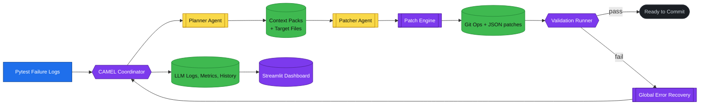
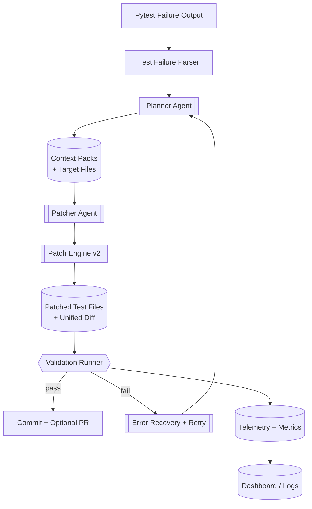

# Mermaid Diagrams

These Mermaid snippets mirror the diagrams rendered in the Streamlit dashboard and add a second view that drills into the TestSentry workflow. Open this file in Cursor (or any Markdown preview with Mermaid support) to see the diagrams rendered locally.

## CAMEL Architecture Overview

## TestSentry Workflow

